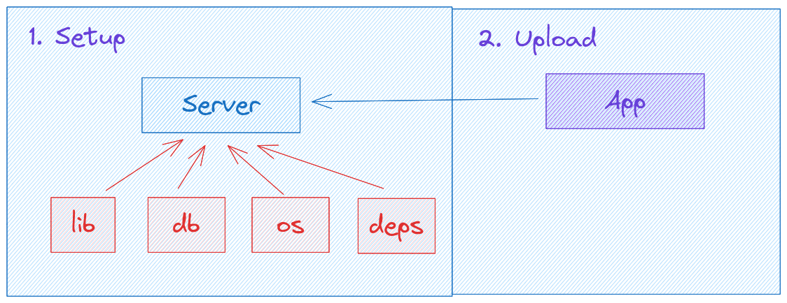
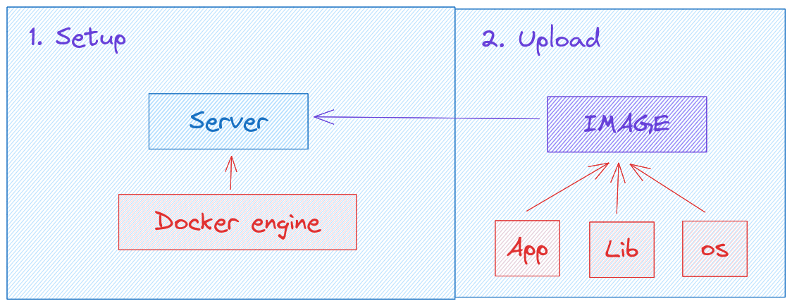
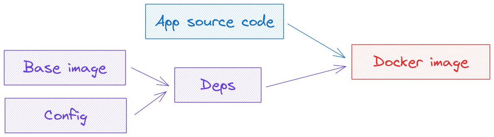
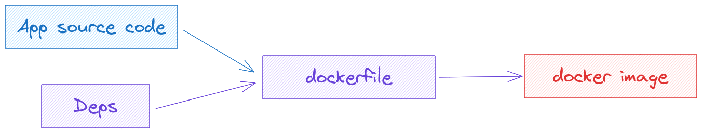
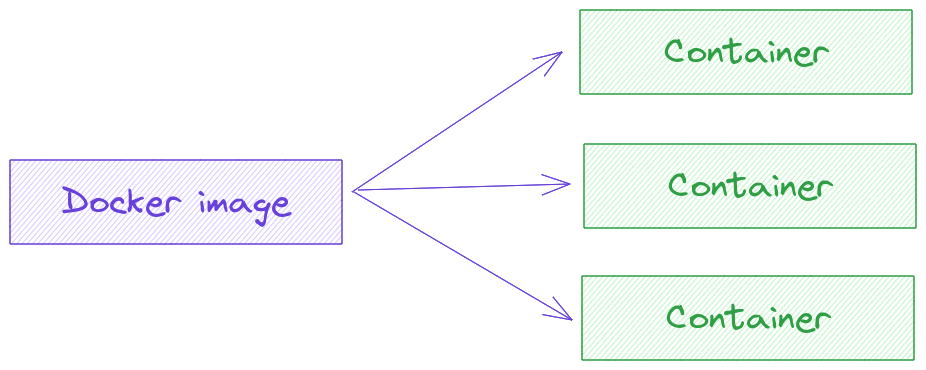
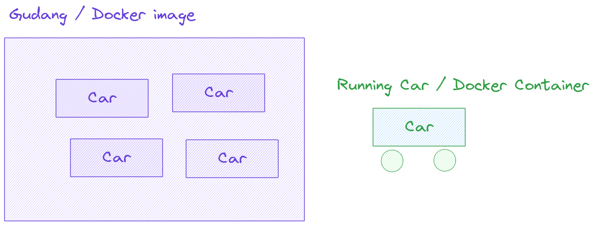
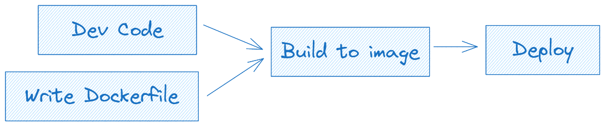
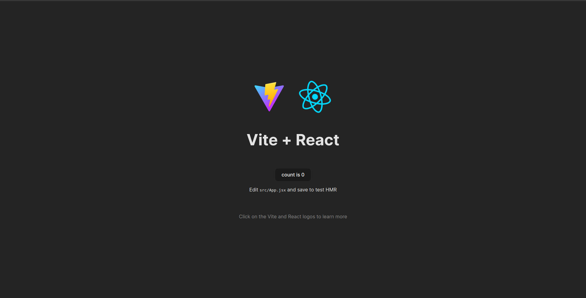

## The 7 days of devops

> By Amirul-git

> Get taste of becoming a devops engineer with only 7 days or less. From docker, monitoring, to kubernetes and k3s. Based on writer journey on learning docker to monitoring to Kubernetes

> Note: this is the pre-beta roadmap book, expect changes in future but the big idea is the same

#### Docker

- [x] Apa itu docker
- [x] Docker image, dockerfile, dan docker container
  - [x] Docker Image
  - [x] Dockerfile
  - [x] Docker Container
- [x] Docker workflow
- [x] Kontainerisasi aplikasi
  - [x] Requirement
  - [x] Create Dockerfile
  - [x] Build Image
  - [x] Run Image
- [x] Optimasi docker image dengan multi stage build
  - [x] Problem dari docker image yang tidak teroptimasi
  - [x] Requirement
  - [x] Update dockerfile
  - [x] Build and Run
  - [x] v1 (Build) vs v2 (Multi stage build)
- [x] Docker compose
  - [x] Intro
  - [x] Struktur docker compose
  - [x] Docker compose image react

#### ECR, The Container Registry

- [ ] Quick intro ECR
- [ ] AWS iam + role + cli
- [ ] Push image ke ECR
- [ ] Pull image ke local
- [ ] Run image dari ECR di local

#### EC2, The Cloud Server

- [ ] EC2 quick intro
- [ ] Update aws iam role
- [ ] Spin up a new EC2 Instance
- [ ] Set up deps, docker, aws cli, login ecr
- [ ] Run docker coompose
- [ ] Set up aws security to port 80
- [ ] Access via browser

#### Github Action, The glue of CI/CD

- [ ] GA intro, and what the CI/CD is about
- [ ] Basic walktrhough
  - [ ] secrets, dulu bingung gimana cara buat .pem nya, bahas itu juga
- [ ] What I wish I wkno
  - [ ] don't shy to looks for someone elses implementation
- [ ] main.yaml
- [ ] explanation

#### AWS Route 53

- [ ] Route 53 Intro
- [ ] Buy domain name
- [ ] Linkup domain with route 53
- [ ] Linkup ec2 instance with route 53

#### AWS Load Balanccer

- [ ] AWS load balancer intro
- [ ] Create another app, this time we use simple node server
- [ ] Create load balancer
- [ ] Set up load balancer based on the group
- [ ] Link up load balancer with domain
- [ ] Make it secure with HTTPS

> Ooops, we had a new problem, aplikasi kita dapat banyak pengunjung dan kita harus setup semunya, server, dll dengan cepat, what should we do?, orang yang ngerti infra-nya juga masih cuti liburan ke kalimantan jadi gk bisa dihubungi sama sekali

> Tenang, kan sudah ada automation yang sudah dibuatin oleh infra-eng nya

#### Infra automation with Terraform

- [ ] Terraform intro
- [ ] Terraform sturcture
- [ ] What i wish i know
  - [ ] variable
  - [ ] how to read the docs
  - [ ] don't shy to copy
- [ ] Terraform workflow
- [ ] Write .tf
- [ ] Create a new ec2 instance

#### Config automation with Ansible

- [ ] Ansible Intro
- [ ] Connect ansible with aws, add aws role to create instances
- [ ] Ansible playbook
- [ ] What I wish I know
  - [ ] Just use another person plyabook if it exist
  - [ ] Apply ansible
- [ ] Perbaharui load balancer untuk terhubung ke instance yang baru

#### Logging the server resource with Prometheus - node exporter

- [ ] Intro to node exporter - prometheus
- [ ] Fast setup with docker
- [ ] Setup docker compose in server
- [ ] Your task, automate this one with ansible

#### Monitoring with Grafana

- [ ] Intro to grafana
- [ ] Fast setup with docker
- [ ] Connect and monitor with prometheus

### Kubernetes

- [ ] Kubernetes intro and use minikube
- [ ] How should we learn it? get taste of it as soon as possible
- [ ] The big picture of kubernetes. Kubernetes manifest file here
- [ ] Write the manifest file, I mean copy from docs
- [ ] Kubernetes deployments
  - [ ] Create -f \*
- [ ] Kubernetes services
- [ ] Kubernetes Ingress
- [ ] Horizontal Pods Autoscaller

#### K3S

---

# Docker

### 1. Apa itu docker

Docker adalah salah satu teknologi kontainerisasi yang memudahakan developer untuk upload aplikasinya ke server

Kenapa diklaim mudah?

Ayok kita coba bandingan dengan cara tradisional dalam mendeploy aplikasi.

Saat kita mau deploy aplikasi ke server dengan cara tradisional, kita harus setup dan install berbagai library, package, dan dependensi yang dibutuhkan oleh aplikasi di server agar aplikasi yang kita deploy itu dapat berjalan dengan baik



Kelemaahan dari cara seperti ini apa?

Kita mungkin akan mendapatkan masalah "it works on my machine" problem. Di localhost codenya jalan, tapi di server enggak

Nah dengan adanya docker kita akan membungkus semua keperluan yang dibutuhkan olehaplikasi kita ke dalam suatu IMAGE. dan server yang telah terinstall docker engine dapat langsung menjalankan IMAGE tersebut



Melalui cara ini, kita akan terhindar dari masalah it works on my machine problem karena keperluan untuk menjalankan aplikasi sudah kita definisikan di awal dan orang lain yang ingin gabung ngerjain tinggal minta dockerfile + code app nya

> Don't worry, kita akan bahas Dockerfile dan docker Image kok kedepannya

### 2. Docker Fundamental

#### Docker Image

Docker image adalah hasil penggabungan antara source code program kita dengan berbagai dependensi yang dibutuhkan agar code aplikasi tersebut dapat dijalankan.

Dependensi tersebut dapat berupa base image tempat aplikasi akan dijalankan dan juga config seperti command apa yang dipakai untuk menjalankan aplikasi tersebut.



> Masih bingung tentang apa itu base image? jadi base image itu seperti jalan tempat kendaraan (app) kita akan berjalan. Misal base image node-alpine:latest adalah jalan tempat kendaraan (app) bertipe node.js akan dijalankan

> Linux OS + App environtment (example, node.js) = base image

> App + Dependesinya yang dibutuhkan agar app bisa berjalan = Docker image

#### Dockerfile

Dockerfile adalah file berisi script yang kita tulis untuk membuat docker image. Sebelumnya kan kita sudah tau bahwa docker image itu sebenarnya adalah source code app kita + dependensi yang diperlukan agar app kita tersebut dapat berjalan, nah untuk membuat docker image tersebut disini kita harus membuat dockerfile-nya



Dockerfile sendiri terbagi ke dalam 3 struktur besar.

1. Dimana harus dijalankan (base image)
2. Dimana letak source code appnya di local lalu mau di taruh dimana pada base image (code setup)
3. bagaimana cara menjalankan aplikasinya (run)

```
###### base image ######

FROM node-alpine:18

###### base image ######

### code setup ###

WORKDIR /app

COPY package.json .

RUN npm install

COPY . .

###### code setup ######

###### run ######

EXPOSE 4000

CMD ["npm", "run", "dev"]

###### run ######

```

#### Docker Container

Docker container adalah docker image yang telah dijalanakan. kita bisa membuat banyak container dari suatu docker image



Masih bingung? coba bayangkan kalau docker image adalah gudang penyimpanan kendaraan, maka docker container adalah salah satu kendaraan yang telah dijalankan keluar gudang



Masih bingung juga? ayok kita coba praktek aja langsung ya, tapi sebelum itu kita perlu tau dulu bagaimana cara kita bekerja dengan docker (docker workflow)

## Docker Workflow

Ada 2 workflow (proses kerja) yang bisa kita terapkan dalam menggunakan docker. Workflow production (code nya selesai dulu semua lalu buat dockerfile), Workflow hybrid (dockerfile dan code dibuat secara bersamaan dan diubah sesuai kebutuhan)

#### 1. Production

Workflow production itu mengutamakan code nya agar selesai dulu, setelah itu kita baru membuat dockerfile sesuai dengan kebutuhan kode app kita.


#### 2. Hybrid

Workflow hybrid berfokus pada perkembangan sistem, dan umumnya diterapkan pada project baru yang memang direncanakan untuk menggunakan docker. Dalam workflow ini dockerfile dan code dibuat bersamaan dan dikembangkan sesuai kebutuhan.



## Kontainerisasi Aplikasi

Setelah kita mengatahui dasar dari docker, kali ini kita akan coba menerapkan pemahaman kita untuk mengkontainerisasi lalu build docker image dari suatu aplikasi.

Untuk studi kasusnya kita akan pakai aplikasi hello world react.

#### 1. Requirement

Untuk dapat mengkontainerisasi aplikasi. kita sebelumnya harus tau dulu bagaimana cara menjalankan aplikasi tersebut di local, lalu setelah itu kita bisa mulai dan faham cara untuk menulis dockerfile nya.

Misal, karena kita akan menggunakan react, maka kita harus mengerti bagaimana menjalankan aplikasi tersebut di localhost dan apa saja dependensi yang dibutuhkan agar aplikasi tersebut dapat berjalan.

```
# menjalankan aplikasi react, port nya di 5173
npm run dev
```

Di react, dependensi aplikasi tersimpan di package.json, dan kita bisa gunakan `npm install` untuk menginstall dependensi tersebut sebelum menjalankan aplikasi agar aplikasnya bisa dijalankan.

#### 2. Create Dockerfile

Sekarang kita ngerti kalau react ternyata perlu dependensi yang harus di install, cara installnya kita udah tau, dan kita juga udah tau gimana cara menjalankan aplikasi react kita tersebut, jadi sekarang kita bisa lanjut untuk membuat dockerfilenya.

```
# task: buat file dengan nama Dockerfile

FROM node:18-alpine

WORKDIR /app

COPY package.json .

RUN npm install

COPY . .

EXPOSE 5173

CMD [ "npm", "run", "dev" ]

```

#### 3. Build Image

Untuk membuat membuat image dari dockerfile tersebut kita bisa gunakan `docker build` command di terminal

```
docker build -t devopsbook:1.0.0 .
```

Tapi sebelum di build teman-teman harus ubah dulu `viteconfig.js` nya agar bisa menggunakan docker.

```
// dari code seperti ini
export default defineConfig({
  plugins: [react()],
});

// jadi seperti ini

export default defineConfig({
  plugins: [react()],
  server: {
    watch: {
      usePolling: true,
    },
    host: true, // needed for the Docker Container port mapping to work
    strictPort: true,
    port: 5173, // you can replace this port with any port
  }

```

Selain itu kita akan membuat file `.dockerignore` untuk file-file yang tidak seharusnya kita tambahkan ke dalam image

```
# task: buat docker ignore dan tambahkan node_module

node_modules
```

#### 4. Run Image

Dan untuk menjalan image tersebut menjadi kontainer kita bisa gunakan `docker run` command

> Sebenarnya jauh lebih mudah untuk melihat image yang kita buat dengan menggunakan app docker desktop, jadi teman-teman tidak harus menggunakan terminal. karena yang penting teman-teman ngerti dulu alur workflow nya.

```
docker run -d -p 5173:5173 devopsbook:1.0.0
```

Sekarang kita bisa mengakses aplikasi react kita yang telah terkontainerisasi tersebut di `localhost:5173`



> Tips: kalau bingung isi dockerfile untuk framework x misalnya, gpp untuk lihat dockerfile orang lain di github/google

## Optimasi docker image dengan multi stage build

#### Problem dari docker image yang tidak teroptimasi

Image yang telah kita build sebelumnya mungkin bisa digunakan untuk membuat container yang works. Akan tetapi sebenarnya image tersebut memiliki beberapa kelemahan

1. Masih menggunakan dev `npm run dev`
   Seharusnya kita tidak menggunakan `npm run dev` untuk production karena command tersebut digunakan untuk mode development
2. Size nya yang sangat besar karena belum di optimasi

Sebenarnya aplikasi yang kita buat di react itu bisa kita optimasi untuk production, dan command yang kita gunakan sebenarnya bukan `npm run dev`, tapi `npm run build` sehingga aplikasi kita akan di build sebagai `html+css+js` biasa yang teroptimasi

#### Requirement

Sebelum kita mengubah dockerfile kita akan menggunakan `npm run dev`, kita perlu tau bahwa hasil build dari command tersebut adalah `html+css+js`. Tanpa webserver sama sekali. Oleh karena itu kita perlu menggunakan baseimage tambahan sebagai webserver.

Jadi kita akan punya 2 base image, base image `node` untuk build aplikasi kita, dan base image `nginx` sebagai server yang akan serve aplikasi kita.

Oleh karena kita akan menggunakan `nginx`, kita perlu membuat file config untuk `nginx`.

```
taks: buat file /docker/nginx/conf.d/default.conf

server {
    listen 80;
    root /usr/share/nginx/html;
    index index.html;

    location / {
        try_files $uri $uri/ /index.html;
    }
}
```

#### Update dockerfile

Sekarang kita memfungsikan base image `node` untuk build image nya, dan base image `nginx` untuk server yang akan serve hasil build dari aplikasi react kita ke user

```
FROM node:18-alpine as build

WORKDIR /usr/app

COPY package.json .

RUN npm install

COPY . .

RUN npm run build

FROM nginx:1.23.1-alpine

EXPOSE 80

COPY ./docker/nginx/conf.d/default.conf /etc/nginx/conf.d/default.conf

COPY --from=build /usr/app/dist /usr/share/nginx/html
```

Sekarang dockerfile kita sudah bisa digunakan untuk build image yang telah teropsimasi. kalau sebelumnya kita aplikasinya menggunakan vite server, sekarang sudah pakai nginx

#### Build dan Run

```
# build
docker build -t devopsbook:2.0.0 .

# run
docker run -d -p 5173:5173 devopsbook:2.0.0
```

#### v1 vs v2

Mungkin teman-teman bertanya-tanya kenapa sih kita repot-repot untuk melakukan multi stage build. Kan build biasa dengan `npm run dev` sudah bisa jalan aplikasinya.

Ya memang benar aplikasinya dapat berjalan, tapi sebenarnya image yang kita buat tanpa multi stage build tadi belum teroptimasi. Size image yang belum teroprimasi bisa mencapai ratusan mb sedangkan yang teroptimasi hanya puluhan mb. Selain itu multi stage build yang telah kita lakukan sudah sesuai dengan environment production karena memang seharusnya kita tidak boleh run app yang environment nya dikhusukan untuk development ke server production.

## Docker compose

#### Intro

Docker compose sebenarnya adalah suatu file script yang ditulis dan difungsikan sebagai kumpulan aturan bagi docker engine untuk menjalankan docker image.

Docker compose sendiri umumnya digunakan di server untuk running berbagai macam image dengan satu kali command maupun bisa juga digunakan di local untuk setup dev environment.

Misal kita butuh untuk menjalankan image `app` kita, butuh menjalankan image `mysql` untuk database dan juga `redis` untuk chaching.

Kalau kita lakukan lakukan docker run satu-satu kan bisa capek banget ya, oleh karena itu kita butuh docker compose agar bisa menjalankan seluruh image yang kita inginkan dengan sekali command.

#### Struktur docker compose

Docker compose ditulis dengan bahasa yaml dan penamaan yang dipakai adalah `docker-compose.yaml`

Untuk struktur docker compose sendiri dipisahkan berdasarkan service. Service sendiri berisi image apa yang dipakai beserta dengan confignya seperti port, volume, dll.

```
# Struktur docker compose
services:
  name:
    build:
    image:
    port:
  name:
    ...
```

#### Docker compose image react

Sekarang kita akan coba untuk build dan run image menggunakan docker compose

```
version: "3.8"
services:
  frontend:
    build:
      context: .
      dockerfile: Dockerfile
    ports:
      - 9000:80
```

Untuk menjalan file docker compose yang telah dibuat, teman-teman bisa menggunakan command `docker compose up` untuk, dan untuk mendestroy bisa menggunakan command `docker compose down`

Untuk di server sendiri, umumnya kita sudah memiliki image yang telah di build, oleh karena itu docker compose nya tidak perlu build lagi, tapi langsung consume imagenya

```
version: "3.8"
services:
  frontend:
    image: devops-book:2.0.0
    ports:
      - 9000:80
```
