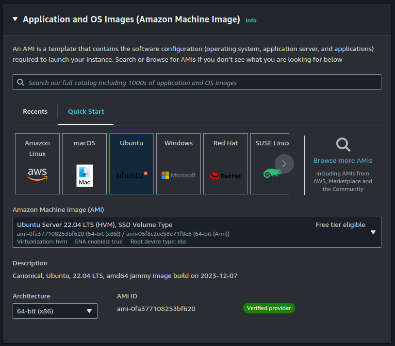

## The 7 days of devops `pre-alpha release`

Get taste of becoming a `devops engineer` with only 7 days or less. From `docker`, `monitoring`, to `kubernetes` and `k3s`. Based on writer journey on learning `docker` to `monitoring` to `Kubernetes` adn `k3s` ~ **_author, amirul-git_**

> This is the pre-alpha roadmap book, expect changes in future but the big idea is the same

#### [Docker](#docker)

- [x] [Apa itu docker](#apa-itu-docker)
- [x] [Docker fundamental](#docker-fundamental)
  - [x] [Docker image](#docker-image)
  - [x] [Dockerfile](#dockerfile)
  - [x] [Docker container](#docker-container)
- [x] [Docker workflow](#docker-workflow)
- [x] [Kontainerisasi aplikasi](#kontainerisasi-aplikasi)
  - [x] [Requirement](#requirement)
  - [x] [Create dockerfile](#create-dockerfile)
  - [x] [Build image](#build-image)
  - [x] [Run image](#run-image)
- [x] Optimasi docker image dengan multi stage build
  - [x] Problem dari docker image yang tidak teroptimasi
  - [x] Requirement
  - [x] Update dockerfile
  - [x] Build and Run
  - [x] v1 (Build) vs v2 (Multi stage build)
- [x] Docker compose
  - [x] Intro
  - [x] Struktur docker compose
  - [x] Docker compose image react

#### ECR, The Container Registry

- [x] Apa itu Container Registry
- [x] Requirement
  - [x] AWS iam, user dan permission
  - [x] AWS CLI
- [x] Push image ke ECR
- [x] Pull image dari ECR ke local
- [x] Run image yang telah di pull dari ECR di local

#### EC2, The Cloud Server

- [x] Apa itu EC2
- [x] Membuat EC2 instance
- [x] Setup `docker`, `aws cli`, login `ecr`
- [x] Setup docker compose
- [x] Mengakses aplikasi melalui browser

#### Github Action, The glue of CI/CD

- [ ] GA intro, and what the CI/CD is about
- [ ] Basic walktrhough
  - [ ] secrets, dulu bingung gimana cara buat .pem nya, bahas itu juga
- [ ] What I wish I wkno
  - [ ] don't shy to looks for someone elses implementation
- [ ] main.yaml
- [ ] explanation

#### AWS Route 53

- [ ] Route 53 Intro
- [ ] Buy domain name
- [ ] Linkup domain with route 53
- [ ] Linkup ec2 instance with route 53

#### AWS Load Balanccer

- [ ] AWS load balancer intro
- [ ] Create another app, this time we use simple node server
- [ ] Create load balancer
- [ ] Set up load balancer based on the group
- [ ] Link up load balancer with domain
- [ ] Make it secure with HTTPS

> Ooops, we had a new problem, aplikasi kita dapat banyak pengunjung dan kita harus setup semunya, server, dll dengan cepat, what should we do?, orang yang ngerti infra-nya juga masih cuti liburan ke kalimantan jadi gk bisa dihubungi sama sekali

> Tenang, kan sudah ada automation yang sudah dibuatin oleh infra-eng nya

#### Infra automation with Terraform

- [ ] Terraform intro
- [ ] Terraform sturcture
- [ ] What i wish i know
  - [ ] variable
  - [ ] how to read the docs
  - [ ] don't shy to copy
- [ ] Terraform workflow
- [ ] Write .tf
- [ ] Create a new ec2 instance

#### Config automation with Ansible

- [ ] Ansible Intro
- [ ] Connect ansible with aws, add aws role to create instances
- [ ] Ansible playbook
- [ ] What I wish I know
  - [ ] Just use another person plyabook if it exist
  - [ ] Apply ansible
- [ ] Perbaharui load balancer untuk terhubung ke instance yang baru

#### Logging the server resource with Prometheus - node exporter

- [ ] Intro to node exporter - prometheus
- [ ] Fast setup with docker
- [ ] Setup docker compose in server
- [ ] Your task, automate this one with ansible

#### Monitoring with Grafana

- [ ] Intro to grafana
- [ ] Fast setup with docker
- [ ] Connect and monitor with prometheus

### Kubernetes

- [ ] Kubernetes intro and use minikube
- [ ] How should we learn it? get taste of it as soon as possible
- [ ] The big picture of kubernetes. Kubernetes manifest file here
- [ ] Write the manifest file, I mean copy from docs
- [ ] Kubernetes deployments
  - [ ] Create -f \*
- [ ] Kubernetes services
- [ ] Kubernetes Ingress
- [ ] Horizontal Pods Autoscaller

#### K3S

---

# Docker

### Apa itu `docker`

`Docker` adalah salah satu teknologi kontainerisasi yang memudahakan developer untuk deploy aplikasinya ke server

Kenapa dengan menggunakan `docker` proses deployment bisa jadi lebih mudah?

Ayok sekarang kita coba bandingkan deh, cara kita deploy aplikasi dengan cara tradisional dan dengan menggunakan `docker`

##### Tradisional way

Dengan metode tradisonal, kita harus setup dan install berbagai `library`, `package`, dan `dependensi` yang dibutuhkan oleh aplikasi kita di server agar aplikasi kita berjalan dengan baik


Sebenarnya metode di atas itu fine-fine aja ya, tapi dengen tetap melestarikan cara diatas, masalah-masalah ngeselin seperti `it works on my machine probem` suatu saat akan muncul. Di `local machine` app kita jalan normal, tapi pas di server gk jalan samsek dan malah muncul warning sampai error-error yang ajaib.

Capek kan ya kalau kita harus solve satu-satu. Kalau kita yang buat aplikasinya gpp lah ya, setidaknya kita bisa ngerti how to solve the problem-nya, tapi gimana coba kalau kita cuma di handover untuk dideploy..., bisa wasalam malam minggu kita wkwkw

Nah dengan menggunakan `docker`, problem diatas bisa langsung kita lenyapkan.

##### Docker way

Kalau kita menggunakan docker untuk deployment aplikasi, setiap `dependensi`, `config`, dan `keperluan lain` yang dibutuhkan oleh aplikasi kita akan di bungkus jadi satu menjadi sebuah `docker image` yang bisa dijalankan langsung oleh server yang telah terinstall `docker engine`


Dengan menerapkan `docker` seperti cara diatas, kita dapat terhindar dari masalah `it works on my machine` karena setiap keperluan untuk menjalankan aplikasi telah kita bundle menjadi sebuah `docker image`

Selain itu orang lain yang ingin ikut develop aplikasi kita juga jadi lebih mudah karena kita tinggal berikan `code app` + `dockerfile`

> santuy santuy, kita akan bahas dockerfile dan docker image kok kedepannya

### Docker Fundamental

#### Docker image

`Docker image` adalah hasil penggabungan antara `source code` program kita dengan berbagai `dependensi` yang dibutuhkan agar code aplikasi tersebut dapat dijalankan.

Dependensi tersebut dapat berupa `base image` yang merupakan tempat aplikasi akan dijalankan, serta `config` seperti command apa yang dipakai untuk menjalankan aplikasi tersebut.


> Masih bingung tentang apa itu `base image`? jadi `base image` itu seperti jalan tempat kendaraan (app) kita akan berjalan. Misal `base image` `node-alpine:latest` adalah jalan tempat kendaraan (app) bertipe `node.js` akan dijalankan

> `Linux OS` + `App environtment` (example, node.js) = `base image`

> `App` + `Dependesi` yang dibutuhkan agar app bisa berjalan = `Docker image`

#### Dockerfile

`Dockerfile` adalah file berisi script yang kita tulis untuk membuat `docker image`. Sebelumnya kan kita sudah tau bahwa `docker image` itu sebenarnya adalah `source code app` kita + `dependensi` yang diperlukan agar app kita tersebut dapat berjalan, nah untuk membuat `docker image` tersebut disini kita harus membuat `dockerfile`-nya


`Dockerfile` sendiri terbagi ke dalam 3 struktur besar.

1. Dimana harus dijalankan (`base image`)
2. Dimana letak source code appnya di local lalu mau di taruh dimana pada base image (`code location`)
3. bagaimana cara menjalankan aplikasinya (`run`)

```
###### base image ######

FROM node-alpine:18

###### base image ######


### code setup ###

WORKDIR /app

COPY package.json .

RUN npm install

COPY . .

###### code setup ######


###### run ######

EXPOSE 4000

CMD ["npm", "run", "dev"]

###### run ######

```

#### Docker Container

`Docker container` adalah `docker image` yang telah dijalanakan. Btw kita bisa membuat banyak `container` dari suatu `docker image`


Masih bingung? coba bayangkan kalau `docker image` adalah gudang penyimpanan kendaraan, maka `docker container` adalah salah satu kendaraan yang telah dijalankan


Masih bingung juga? ayok kita coba praktek aja langsung ya, tapi sebelum itu kita perlu tau dulu bagaimana cara kita bekerja dengan `docker` (`docker workflow`)

## Docker workflow

Ada 2 workflow (proses kerja) yang bisa kita terapkan dalam menggunakan docker. Workflow production (code nya selesai dulu semua lalu buat dockerfile), Workflow hybrid (dockerfile dan code dibuat secara bersamaan dan diubah sesuai kebutuhan)

#### 1. Production

`Workflow production` adalah workflow yang mengutamakan code nya agar selesai aja dulu, lalu setelah itu kita baru membuat dockerfile-nya sesuai dengan kebutuhan.


#### 2. Hybrid

Workflow hybrid berfokus pada perkembangan sistem, dan umumnya diterapkan pada project baru yang memang direncanakan untuk menggunakan `docker`. Dalam workflow ini `dockerfile` dan code dibuat bersamaan dan dikembangkan sesuai kebutuhan .


## Kontainerisasi Aplikasi

Karena kita telah ngerti dasar dari docker, sekarang kita akan coba lanjut prakatek ya ges ya. Biar ilmu kita semakin setrong...

Studi kasus yang akan kita gunakan adalah aplikasi `react hello-world` dari `vite`

Santuy..., kita gk akan ngoding react kok, kita hanya akan gunakan aplikasi react yang sudah ada untuk praktek ilmu-ilmu `docker` kita

#### Requirement

Agar kita bisa ngerti cara kontainerisasi aplikasi, kita seblumnya harus ngerti dulu nich gimana cara menjalankan suatu aplikasi `react` di `local machine`. Dengan langkah demikian, kita akan lebih mudah dan lebih tau step by step untuk menulis `dockerfile`-nya

> Karena pada akhirnya ya, dockerfile itu cuma file konfigurasi agar docker ngerti apa aja yang dibutuhkan oleh aplikasi kita untuk dapat berjalan dan gimana cara menjalankannya

Misal, karena kita akan menggunakan `react`, maka kita harus ngerti dulu gimana cara menjalankan aplikasi `react` di `local machine` dan apa saja `dependensi` yang dibutuhkan agar aplikasi tersebut dapat berjalan.

```
npm run dev #command run react
```

> karena kita menggunakan vite, portnya otomatis di 5173, jadi untuk aksesnya localhost:5173

Di react, dependensi aplikasi tersimpan di package.json, dan kita bisa gunakan `npm install` untuk menginstall dependensi tersebut sebelum menjalankan aplikasi agar aplikasnya bisa dijalankan.

#### Create Dockerfile

Sekarang kita ngerti kalau aplikasi `react` kita akan jalan di `port 5173` dan perlu dependensi yang harus di install dulu sebelum di jalankan pertama kali

Sekarang cara install dependensinya kita udah tau, dan kita juga udah ngerti gimana cara menjalankan aplikasi `react` kita tersebut, jadi sekarang kita bisa lanjut untuk membuat `dockerfile`-nya.

Buat file dengan nama Dockerfile

```
touch Dockerfile
```

Lalu buat script untuk dockerfile-nya. React kan berjalan di node ya, jadi kita perlu `base image` `node js`, disini kita pakai `node:18-alpine`, berikutnya kita mau taruh mana sih source code aplikasinya? kita akan taruh di folder `/app` biar tertata rapi, jadi kita akan tetapkan `workdir` nya adalah `/app` kalau gitu

Berikutnya kita akan taruh duluan `package.json` nya ya, karena kan untuk berjalan aplikasi kita harus ada dependensinya dulu kan ya

Setelah itu, step berikutnya adalah menaruh source code aplikasi kita ke workdir yang telah kita buat sebelumnya yaitu `/app`, tapi karena kita nulis `dockerfile`-nya di tempat yang sama dengan source code app kita, maka kita bisa singkat dengan titik titik aja `COPY . .`, lalu karena app kita dijalankan di `port 5173` kita harus expose port nya agar bisa jalan juga di local

Terakhir kita tulis gimana cara kita untuk menjalankan aplikasi, yaitu `npm run dev`

Hasil akhirnya seperti dibawah ya ges, syntax seperti `FROM`, `WORKDIR`, `COPY`, `EXPOST`, `RUN` merupakan command `docker`. Santuy, gk perlu dipelajari semua, umumnya diawal kita cuma butuh yang dasar-dasar dulu seperti diatas.

```
FROM node:18-alpine

WORKDIR /app

COPY package.json .

RUN npm install

COPY . .

EXPOSE 5173

CMD [ "npm", "run", "dev" ]

```

#### Build image

Untuk membuat membuat image dari `dockerfile` diatas kita bisa gunakan `docker build` command di terminal

```
docker build -t devopsbook:1.0.0 .
```

Tapi sebelum di build teman-teman harus ubah dulu `viteconfig.js` nya agar bisa menggunakan `docker`.

```
// dari code seperti ini
export default defineConfig({
  plugins: [react()],
});

// jadi seperti ini

export default defineConfig({
  plugins: [react()],
  server: {
    watch: {
      usePolling: true,
    },
    host: true, // needed for the Docker Container port mapping to work
    strictPort: true,
    port: 5173, // you can replace this port with any port
  }

```

Selain itu kita akan membuat file `.dockerignore` untuk file-file yang tidak seharusnya kita tambahkan ke dalam `docker image`

Buat `.dockerignore` file, lalu tambahkan node_modules agar gk di include juga di `docker image` kita

```
node_modules
```

#### Run image

Dan untuk menjalan image tersebut menjadi kontainer kita bisa gunakan `docker run` command

> Sebenarnya jauh lebih mudah untuk melihat image yang kita buat dengan menggunakan app docker desktop, jadi teman-teman tidak harus menggunakan terminal. karena yang penting teman-teman ngerti dulu alur workflow nya.

```
docker run -d -p 5173:5173 devopsbook:1.0.0
```

Sekarang kita bisa mengakses aplikasi `react` kita yang telah terkontainerisasi tersebut di `localhost:5173`


> Tips: kalau bingung isi dockerfile untuk framework x misalnya, gpp untuk lihat dockerfile orang lain di github/google

## Optimasi docker image dengan multi stage build

#### Problem dari docker image yang tidak teroptimasi

Image yang telah kita build sebelumnya mungkin bisa digunakan untuk membuat container yang works. Akan tetapi sebenarnya image tersebut memiliki beberapa kelemahan

1. Masih menggunakan dev `npm run dev`
   Seharusnya kita tidak menggunakan `npm run dev` untuk production karena command tersebut digunakan untuk mode development
2. Size nya yang sangat besar karena belum di optimasi

Sebenarnya aplikasi yang kita buat di react itu bisa kita optimasi untuk production, dan command yang kita gunakan sebenarnya bukan `npm run dev`, tapi `npm run build` sehingga aplikasi kita akan di build sebagai `html+css+js` biasa yang teroptimasi

#### Requirement

Sebelum kita mengubah dockerfile kita akan menggunakan `npm run dev`, kita perlu tau bahwa hasil build dari command tersebut adalah `html+css+js`. Tanpa webserver sama sekali. Oleh karena itu kita perlu menggunakan baseimage tambahan sebagai webserver.

Jadi kita akan punya 2 base image, base image `node` untuk build aplikasi kita, dan base image `nginx` sebagai server yang akan serve aplikasi kita.

Oleh karena kita akan menggunakan `nginx`, kita perlu membuat file config untuk `nginx`.

```
taks: buat file /docker/nginx/conf.d/default.conf

server {
    listen 80;
    root /usr/share/nginx/html;
    index index.html;

    location / {
        try_files $uri $uri/ /index.html;
    }
}
```

#### Update dockerfile

Sekarang kita memfungsikan base image `node` untuk build image nya, dan base image `nginx` untuk server yang akan serve hasil build dari aplikasi react kita ke user

```
FROM node:18-alpine as build

WORKDIR /usr/app

COPY package.json .

RUN npm install

COPY . .

RUN npm run build

FROM nginx:1.23.1-alpine

EXPOSE 80

COPY ./docker/nginx/conf.d/default.conf /etc/nginx/conf.d/default.conf

COPY --from=build /usr/app/dist /usr/share/nginx/html
```

Sekarang dockerfile kita sudah bisa digunakan untuk build image yang telah teropsimasi. kalau sebelumnya kita aplikasinya menggunakan vite server, sekarang sudah pakai nginx

#### Build dan Run

```
# build
docker build -t devopsbook:2.0.0 .

# run
docker run -d -p 5173:5173 devopsbook:2.0.0
```

#### v1 vs v2

Mungkin teman-teman bertanya-tanya kenapa sih kita repot-repot untuk melakukan multi stage build. Kan build biasa dengan `npm run dev` sudah bisa jalan aplikasinya.

Ya memang benar aplikasinya dapat berjalan, tapi sebenarnya image yang kita buat tanpa multi stage build tadi belum teroptimasi. Size image yang belum teroprimasi bisa mencapai ratusan mb sedangkan yang teroptimasi hanya puluhan mb. Selain itu multi stage build yang telah kita lakukan sudah sesuai dengan environment production karena memang seharusnya kita tidak boleh run app yang environment nya dikhusukan untuk development ke server production.

## Docker compose

#### Intro

Docker compose sebenarnya adalah suatu file script yang ditulis dan difungsikan sebagai kumpulan aturan bagi docker engine untuk menjalankan docker image.

Docker compose sendiri umumnya digunakan di server untuk running berbagai macam image dengan satu kali command maupun bisa juga digunakan di local untuk setup dev environment.

Misal kita butuh untuk menjalankan image `app` kita, butuh menjalankan image `mysql` untuk database dan juga `redis` untuk chaching.

Kalau kita lakukan lakukan docker run satu-satu kan bisa capek banget ya, oleh karena itu kita butuh docker compose agar bisa menjalankan seluruh image yang kita inginkan dengan sekali command.

#### Struktur docker compose

Docker compose ditulis dengan bahasa yaml dan penamaan yang dipakai adalah `docker-compose.yaml`

Untuk struktur docker compose sendiri dipisahkan berdasarkan service. Service sendiri berisi image apa yang dipakai beserta dengan confignya seperti port, volume, dll.

```
# Struktur docker compose
services:
  name:
    build:
    image:
    port:
  name:
    ...
```

#### Docker compose image react

Sekarang kita akan coba untuk build dan run image menggunakan docker compose

```
version: "3.8"
services:
  frontend:
    build:
      context: .
      dockerfile: Dockerfile
    ports:
      - 9000:80
```

Untuk menjalan file docker compose yang telah dibuat, teman-teman bisa menggunakan command `docker compose up` untuk, dan untuk mendestroy bisa menggunakan command `docker compose down`

Untuk di server sendiri, umumnya kita sudah memiliki image yang telah di build, oleh karena itu docker compose nya tidak perlu build lagi, tapi langsung consume imagenya

```
version: "3.8"
services:
  frontend:
    image: devops-book:2.0.0
    ports:
      - 9000:80
```

# ECR, The Container Registry

### Apa itu container registry

Container registry itu bisa diibartkan sebagai git-nya docker image, berfungsi sebagai version control bagi image yang telah di build. Dan ECR (Elastic Container Registry) adalah salah satu container registry ini.


Kenapa kita harus pakai container registry? agar memudahkan kita dalam melakukan penyimpanan, version control. dan distribusi image yang telah kita build. Karena kan kedepannya kita akan deploy image tersebut ke berbagai server ya.

### Requirement

Sebelum kita menggunakan ECR sebagai container registry, sebelumnya kita harus menyiapkan `role iam` yang memiliki akses untuk membuat container registry

Bagi yang belum punya account AWS bisa login aja dulu ya. Kita bisa pakai beberapa resource secara gratis selama setahunan. [**_<u>Create a new aws account</u>_**](https://aws.amazon.com/resources/create-account/)

#### AWS iam, user dan permissions

> AWS iam digunakan untuk melakukan manajemen terhadap akun aws teman-teman, seperti membuat user baru, dan memberikan hak akses kepada user tersebut.

Setelah itu teman-teman bisa mengakses halaman aws iam dan melanjutkan untuk membuat user baru serta memberikan permission (hak akses) kepada user tersebut sehingga dapat melakukan push ataupun pull image ke container registry `AmazonEC2ContainerRegistryFullAccess`


#### AWS CLI

> AWS cli merupakan cli app yang digunakan untuk melakukan manajemen resource AWS melalui terminal. Kenapa adanya CLI? karena server linux tidak ada UI GUI nya, jadi mau tidak mau kita harus menggunakan terminal.

Sebelumnya pastikan AWS cli nya sudah terinstal ya. [**_<u>Install AWS CLI</u>_**](https://docs.aws.amazon.com/cli/latest/userguide/getting-started-install.html)

Lalu selanjutnya kita perlu mengatur AWS CLI untuk menggunakan user dengan permission (`AmazonEC2ContainerRegistryFullAccess`) yang telah kita buat sebelumnya dan juga meng set region yang ingin kita pakai.

> region adalah lokasi datacenter aws yang ingin teman-teman gunakan. aws datacenter sendiri tersebar di beberapa negara, dan yang paling dekat dengan indonesia adalah `ap-southeast-1` di singapura dan `ap-southeast-3` di jakarta


Berikut adalah tampilan AWS user yang telah memiliki permission `AmazonEC2ContainerRegistryFullAccess`


#### Push image ke ECR

Untuk bisa upload image ke ECR, kita perlu untuk login terlebih dahulu di terminal dengan user IAM yang telah kita buat sebelumnya. pastikan user nya sudah memiliki permission `AmazonEC2ContainerRegistryFullAccess` ya.

Selanjutnya kita akan configure terminal kita agar bertindak sebagai IAM role yang telah kita buat, kita bisa ketikkan `aws configure` dan isi semua field yang dibutukan.


> AWS Access Key ID dapat di lihat di detail IAM users, tinggal klik create access key dan pilih CLI
> AWS Secret Key akan teman-teman dapatkan saat membuat AWS Access Key
> Default region name itu nama access point dari

Berikutnya kita akan coba untuk push image kita yaitu `devops-book:2.0.0` ke ECR. Tapi sebelum itu kita harus buat terlebih dahulu online reponya di page AWS ECR. teman-teman bisa akses halaman ECR lalu klik create repository

Setelah berhasil dibuat, teman-teman bisa klik view push commands button dan ikuti instruksi push image nya ke ECR


```
<!-- build dulu image nya jika belum -->
docker build -t devops-book:2.0.0 .

<!-- rename build image sesuai nama repo -->
docker tag devops-book:2.0.0 nama-repo-aws-ecr:latest

<!-- push docker image ke repo -->
docker push nama-repo-aws-ecr:latest
```

Saat push image berhasil teman-teman akan dapat melihat ada image baru yang terupload.


#### Pull image dari ECR ke local

Karena kita telah berhasil upload image kita di ECR, sekarang kita bisa pull image tersebut baik ke local maupun ke server untuk di run.


Untuk pull image dari ECR kita bisa gunakan `docker pull nama-image-nya:tag`

Misal nama image kita di repo ecr adalah 123/devops-book:latest, maka untuk pull image tersebut dari ECR ke local adalah sebagai berikut

```
docker pull 123/devops-book:latest
```

#### Run image yang telah di pull dari ECR di local

Untuk run docker image, kita bisa gunakan `docker run nama-image:tag`

Jadi kalau nama image kita adalah `123/devops-book:latest` maka untuk run image tersebut adalah

```
docker run 123/devops-book:latest
```

Berikut adalah tampilan app yang kita run dari image yang telah kita pull dari ECR sebelumnya.


# ECR, The Container Registry

#### Apa itu EC2

EC2 (Elastic Compute Cloud) merupakan server virtual. Jadi ibaratnya kita memiliki komputer yang dapat kita jadikan apapun baik itu untuk serve aplikasi web, untuk training AI, ataupun untuk nambang bitcoin juga bisa loh (canda gaess, kita gk boleh nambang bitcoin pakai `ec2` ya, pelanggaran)

Umumnya kita akan menggunakan EC2 untuk serve aplikasi web maupun API, dan enaknya kita bisa milih beragam spesifikasi yang cocok untuk kebutuhan kita dan harga paling murah itu sekitar $3+, free satu tahun kalau teman-teman cuma pengen test-test ombak dan kalau mau lebih murah lagi teman-teman bisa pakai `spot instance`

#### Membuat `ec2` instance

Untuk membuat `ec2` baru teman-teman bisa search `ec2` di search bar aws nya teman-teman, klik aja. Lalu saat sudah di dashboard `ec2` klik launch instance


Lalu di bagian OS, bisa pilih ubuntu aja dulu, jangan aneh aneh, kenapa pilih ubuntu? karena yang paling familiar :)



Terus teman-teman buat dulu ya keypair-nya, namanya bebas aja gpp dan formatnya pilih yang .pem dan typenya rsa. key pair yang kita buat ini akan ke pakai untuk akses server melalui `ssh`


Sip, itu dulu yang perlu kita set, teman-teman bisa lanjut create instancenya. `ec2` instance yang udah dibuat akan muncul di dashboard `ec2` ya dan untuk akses nya teman-teman bisa akses melalui built-in terminal nya.

Tapi lebih nyamannya kita akan pakai terminal kita sendiri aja ya, file .pem tadi akan jadi key untuk ssh kita. step penggunannya sebenarnya sudah diberikan. teman-teman tinggal klik tombol connect dan pilih ssh client


Berikutnya kita akan lanjut untuk setup `ec2` instance kita tadi agar bisa jalanin docker dan run image react kita, yeay.

#### Setup `docker`, `aws cli`, login `ecr` di `ec2 instance`

Sekarang kan kita udah punya `ec2` instance untuk cloud server kita ya, nah cloud server ini dalamnya masih kosongan gaess, isinya cuma os ubuntu-server yang kita pilih diawal pembuatan tadi.

Agar kita jalankan aplikasi react terkontainerisasi yang telah kita push di `ecr`, kita perlu install dan setup beberapa hal ini. kita perlu install `docker`, install `aws cli`, login dengan `iam role` yang telah kita buat dan pull image kita tadi ke `ec2` instance. Terakhir kita akan buat `docker compose` agar run/stop aplikasinya lebih mudah.

kita jadikan todolist aja kali ya biar gampang :), nanti teman-teman bisa centang deh apa aja yang selesai dan belum selesai

- [ ] Install `docker`
- [ ] Install `aws cli`
- [ ] Login ke aws cli dengan `iam` yang sudah kita buat
- [ ] Login ke `ecr` agar bisa pull image
- [ ] Pull image react kita dari `ecr`
- [ ] Buat `docker compose`
- [ ] Run container melalui `docker compose`

#### Install `docker`

Ok, kita mulai dari install `docker` nya ya, teman-teman bisa search di google `install docker engine` lalu klik yang mengarah ke dokumentasi dockernya aja ya. jangan lupa pilih linux dan variannya ubuntu. ikuti step by step nya dari docs.

> Jangan sampai salah ya gess, yang akan kita pakai disini adalah docker engine, bukan docker desktop.

Hapus package yang kemungkinan bikin conflict

```
for pkg in docker.io docker-doc docker-compose docker-compose-v2 podman-docker containerd runc; do sudo apt-get remove $pkg; done
```

Setup docker apt

```
# Add Docker's official GPG key:
sudo apt-get update
sudo apt-get install ca-certificates curl gnupg
sudo install -m 0755 -d /etc/apt/keyrings
curl -fsSL https://download.docker.com/linux/ubuntu/gpg | sudo gpg --dearmor -o /etc/apt/keyrings/docker.gpg
sudo chmod a+r /etc/apt/keyrings/docker.gpg

# Add the repository to Apt sources:
echo \
  "deb [arch=$(dpkg --print-architecture) signed-by=/etc/apt/keyrings/docker.gpg] https://download.docker.com/linux/ubuntu \
  $(. /etc/os-release && echo "$VERSION_CODENAME") stable" | \
  sudo tee /etc/apt/sources.list.d/docker.list > /dev/null
sudo apt-get update

```

Install docker package

```
sudo apt-get install docker-ce docker-ce-cli containerd.io docker-buildx-plugin docker-compose-plugin
```

Cek apakah instalasi kita berhasil dengan run image hello world nya

```
sudo docker run hello-world

```

Berikut message yang muncul setelah kita berhasil run image hello-world

```
Unable to find image 'hello-world:latest' locally
latest: Pulling from library/hello-world
c1ec31eb5944: Pull complete
Digest: sha256:ac69084025c660510933cca701f615283cdbb3aa0963188770b54c31c8962493
Status: Downloaded newer image for hello-world:latest

Hello from Docker!
This message shows that your installation appears to be working correctly.

```

Yeay, docker sudah berhasil teristall :)

#### Install `aws cli`

karena kita akan berinteraksi dengan produk cloud aws, maka kita juga perlu install aws cli di cloud ya gess. [Install aws cli](https://docs.aws.amazon.com/cli/latest/userguide/getting-started-install.html)

Sebelum install `aws cli` kita perlu perlu install unzip terlebih dahulu

```
sudo apt install unzip
```

Lalu kita bisa lanjut install aws cli

```
curl "https://awscli.amazonaws.com/awscli-exe-linux-x86_64.zip" -o "awscliv2.zip"
unzip awscliv2.zip
sudo ./aws/install
```

Setelah itu kita bisa login ke iam role kita di aws cli, agar kita bisa pull image react kita

#### Setup `aws cli` sampai pull image dari `ecr`

Kita perlu mengatur `aws cli` agar menggunakan `iam role` yang telah kita buat sebelumnya sehingga kita bisa pull image react dari repo `ecr`

```
aws configure
```

Input semua data yang diperlukan, dan kita bisa coba pull image kita dari `ecr`

Untuk pull image kita dari `ecr` ke `ec2` instance, kita harus login ke ecr dulu ya

> untuk commandnya, teman-teman bisa akses halaman push image dan ambil yang bagian login :)

```
aws ecr get-login-password --region ap-southeast-1 | sudo docker login --username AWS --password-stdin 123.dkr.ecr.ap-southeast-1.amazonaws.com
```

Setelah berhasil login, bisa lanjut pull deh image react nya.

```
docker pull 123.dkr.ecr.ap-southeast-1.amazonaws.com/devops-book:latest
```

Setelah proses pull selesai teman-teman bisa cek image yang teman-teman miliki

```
sudo docker images
```


Voila, sekarang image react kita yang dari `ecr` sudah ter-pull di `ec2`

#### Membuat `docker-compose`

`Docker compose` merupakan tools yang memudahkan kita dalam melakukan menajemen kontainer. Dari yang biasanya kita harus ngetik banyak command setiap kali mau setup aplikasi

```
#jalankan container app
docker run devopsbook:2.0.0 -p 80:80

#jalankan kontainer DB
docker run ...

#jalankan container cache
docker run ...
```

Jadi sesimpel dan semudah

```
docker compose up
```

`Docker compose` sebenarnya adalah sebuah file `.yaml` yang di dalamnya berisi konfigurasi untuk menjalankan kontainer.

Struktur penjelasan lebih detail tentang docker compose teman-teman bisa refer lagi di materi `docker compose` di atas karena kali ini kita akan fokus membuat docker compose untuk image `devops-book:2.0.0`

Btw Kita nulis docker compose nya itu di server ya, jadi teman-teman ssh dulu ke server lalu buat file `compose.yaml`

```
touch compose.yaml

nano compose.yaml
```

Lalu salin konfigurasi `docker compose` berikut ke compose.yaml

```
services:
  frontend:
    image: 1234.dkr.ecr.ap-southeast-1.amazonaws.com/devops-book
    ports:
      - "80:80"
```

Untuk menjalankan docker compose dari file `compose.yaml`, kita perlu ketik command

```
docker compose up -d
```

> -d agar berjalan di background ya, jadi terminal ssh nya masih bisa kita pakai

#### Mengakses aplikasi melalui browser

Nah sekarang teman-teman bisa akses website teman-teman melalui alamat IP public server `ec2`. Hasil nya pasti akan error seperti dibawah


Wow, server kita ternyata jadi unreacheble gaess. kenapa ya wkwk

Tenang gaess, hal ini terjadi karena kita belum atur server `ec2` kita untuk dapat menerima akses dari port 80 `http`.

Jadi yang perlu kita lakukan untuk solve problem ini sebenarnya hanya perlu menambahkan port 80 `http` ke dalam inbound rule security group `ec2` kita seperti dibawah


Sekarang setelah ditambahkan port 80, kita coba akses lagi


Yeay, selamat, aplikasi `react docker` kita sudah bisa jalan di `ec2`

Tapi gimana kalau kita ada update versi baru? prosesnya gimana supaya bisa app kita terupdate?

Caranya sebenarnya agak capek, kita perlu untuk down kan dulu docker composenya, lalu pull versi terbaru dari image aplikasi kita, dan update kembali docker compose nya lalu jalankan lagi `docker compose up`

Kalau update nya sebulan sekali gpp lah ya capek-capek dikit, tapi gimana kalau setiap menit ada update baru dari aplikasi kita? capek banget kan harus melakukan proses repetitif kayak diatas

Oleh karena itu kita akan automasi seluruh pekerjaan repetitif tadi menggunakan `github action`
